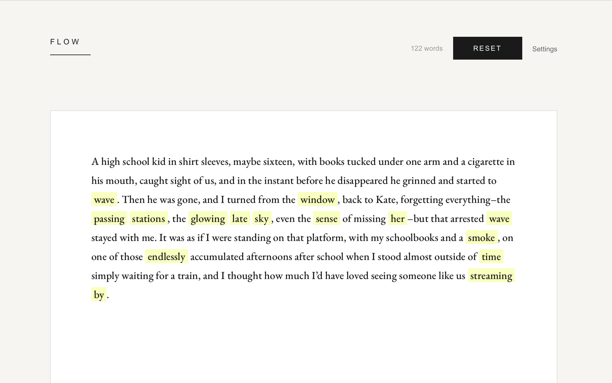

# Flow Highlight - Frontend

Beautiful Next.js + Tailwind CSS frontend for the Flow text highlighting system.

## Features

- 🎨 **Modern UI** - Clean, responsive design with Tailwind CSS
- ⚡ **Real-time Analysis** - Fast text analysis with visual feedback
- 📊 **Interactive Tooltips** - Hover over highlighted words to see suggestions
- 🎛️ **Configurable Settings** - Adjust sensitivity and parameters
- ✅ **Quality Indicators** - Green checkmarks show high-quality suggestions
- 📱 **Responsive** - Works on desktop, tablet, and mobile

## Demo



*Flow in action: highlighting words that could be improved with AI-powered suggestions*

## Quick Start

### 1. Install Dependencies

```bash
npm install
```

### 2. Start the API Server

In a separate terminal, from the main Flow directory:

```bash
source venv/bin/activate
python api_server.py
```

### 3. Start the Frontend

```bash
npm run dev
```

### 4. Open in Browser

Navigate to [http://localhost:3000](http://localhost:3000)

## Usage

1. **Paste Text** - Enter your text in the left input area
2. **Analyze** - Click "Analyze Text" or press Cmd/Ctrl + Enter
3. **Review** - Yellow-highlighted words are flagged for potential editing
4. **Explore** - Hover over highlighted words to see:
   - Why the word was flagged (entropy, rank)
   - Replacement suggestions with quality metrics
   - ✓ marks indicate suggestions that pass all thresholds

## Configuration

Click "Analysis Settings" to adjust:

- **Sensitivity** - Choose Conservative, Balanced, or Aggressive
- **Minimum Entropy** - Higher = only very uncertain words (3.0 - 6.0 bits)
- **Maximum Rank** - Lower = only low-probability words (10 - 200)
- **Suggestions per Word** - How many replacements to show (1 - 5)

## Understanding the Metrics

### Word Metrics

- **Entropy (H)**: Measures uncertainty. Higher = more awkward/unusual
- **Rank**: Position in probability distribution. Higher = less expected
- **Log-prob**: Log probability of the original word

### Suggestion Metrics

- **ΔLL (Delta Log-Likelihood)**: Fluency improvement
  - Positive values = improvement
  - Threshold: ≥1.5 for quality check
- **sim (Similarity)**: Semantic preservation
  - Closer to 1.0 = meaning preserved
  - Threshold: ≥0.95 for quality check
- **✓ (Checkmark)**: Indicates suggestion passes both thresholds

## Project Structure

```
frontend/
├── app/
│   ├── components/
│   │   ├── TextInput.tsx      # Text input area
│   │   ├── HighlightedText.tsx # Results display with tooltips
│   │   └── Controls.tsx        # Settings panel
│   ├── types.ts               # TypeScript types
│   ├── layout.tsx             # Root layout
│   ├── page.tsx               # Main page
│   └── globals.css            # Global styles
├── public/                    # Static assets
├── package.json              # Dependencies
└── tailwind.config.ts        # Tailwind configuration
```

## Development

### Available Scripts

- `npm run dev` - Start development server
- `npm run build` - Build for production
- `npm start` - Start production server
- `npm run lint` - Run ESLint

### Adding New Features

1. **New Component** - Add to `app/components/`
2. **New Type** - Add to `app/types.ts`
3. **Styling** - Use Tailwind utility classes

### API Integration

The frontend connects to the API at `http://localhost:8000`. To change this, update the fetch URL in `app/page.tsx`.

For production, use environment variables:

```bash
# .env.local
NEXT_PUBLIC_API_URL=https://your-api-url.com
```

Then in code:
```typescript
const apiUrl = process.env.NEXT_PUBLIC_API_URL || 'http://localhost:8000';
```

## Building for Production

```bash
# Build
npm run build

# Test production build
npm start
```

## Deployment Options

### Vercel (Recommended)

1. Push code to GitHub
2. Import repository in Vercel
3. Set environment variables (API URL)
4. Deploy!

### Netlify

1. Push code to GitHub
2. Import repository in Netlify
3. Build command: `npm run build`
4. Publish directory: `.next`
5. Deploy!

### Self-hosted

```bash
# Build
npm run build

# Start with PM2
pm2 start npm --name "flow-frontend" -- start
```

## Troubleshooting

### CORS Errors

Make sure the API server has CORS configured for your frontend URL in `api_server.py`:

```python
allow_origins=["http://localhost:3000", "https://your-domain.com"]
```

### Styles Not Loading

Clear `.next` cache:
```bash
rm -rf .next
npm run dev
```

### Port 3000 Already in Use

Use a different port:
```bash
PORT=3001 npm run dev
```

## Tech Stack

- **Next.js 15** - React framework
- **TypeScript** - Type safety
- **Tailwind CSS** - Utility-first styling
- **React Hooks** - State management

## Contributing

Improvements welcome! Areas for enhancement:

- [ ] Dark mode toggle
- [ ] Export results as PDF/HTML
- [ ] Save/load text history
- [ ] Keyboard shortcuts
- [ ] Batch file processing
- [ ] Real-time collaborative editing
- [ ] More visualization options

## License

MIT License - see parent directory LICENSE file for details.
